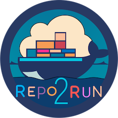

# Repo2Run
The manual experiment logs and results are put in the directory /manual_experiment

The generated Dockerfiles and tracks are put in the directory /success_dockerfile

The validation script is put in /validation_dockerfile.py

The prompts are shown in the directory /prompt

